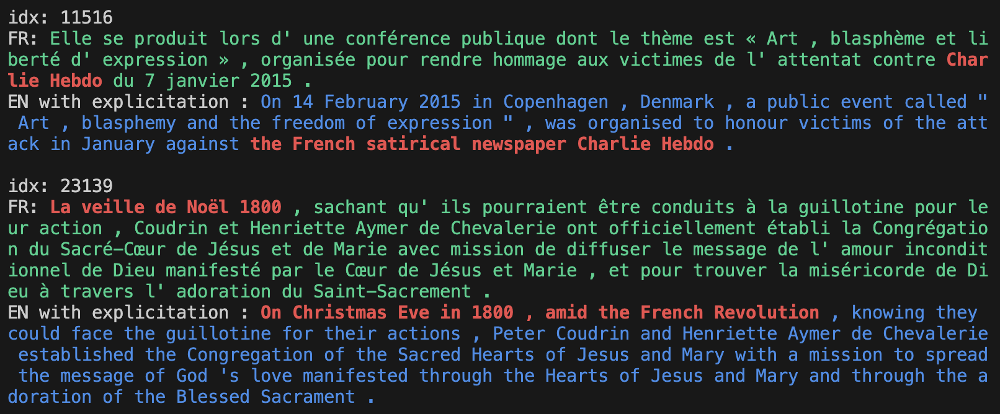

# Bridging Background Knowledge Gaps in Translation with Automatic Explicitation
This repository contains our **WikiExpl** dataset, a semi-automatic collection of naturally occurring explicitations in Wikipedia bitext corpus annotated by human translators, from our EMNLP 2023 main conference paper ([arXiv](https://arxiv.org/abs/2312.01308)).

The `json` files contain the candidates extracted by our detection algorithm.
Each candidate is annotated by three annotators and we assign the label based on the majority vote. 
We consider the candidates as final explicitation if two or more annotators agree.
The list of final explicitation is in `expl_idx_list`. We merge the annotated span of explicitation from different annotators by maximizing the span coverage.

We provide simple tools for easy exploration:
```bash
$ python show.py
```
The output example :

Here the red part in the source text (green) is that which is to be performed explicitation in the corresponding target translation, and the red part in the target text (blue) is its explicitation.

Note: The most recent code in this repo was written in June 2023.

## Environment Setup
```
$ conda create -n autoexpl python=3.9.12
# module load cuda/11.3.1 cudnn/v8.2.1
$ conda activate autoexpl
$ pip3 install torch torchvision torchaudio --extra-index-url https://download.pytorch.org/whl/cu113
$ pip install -r requirements.txt
```

## Building the WikiExpl Dataset of Explicitations
First, This section describes how we collect and examine naturally-occurring explicitations in bitexts commonly used as MT training data. The resulting WikiExpl corpus lets us reason about when explicitation is necessary and lets our automatic explicitation method learn how to generate it.

Code will be provided in the near future.

## Automatic Explicitation
This section builds on WikiExpl to explore generating explicitations automatically.  
We use the XQB dataset, which contains parallel question pairs in English and various non-English languages.  
For more details of [xQB dataset](https://aclanthology.org/2022.emnlp-main.378/) and [Quizbowl task](https://arxiv.org/abs/1904.04792), please refer to each links.  
The original XQB dataset is from https://github.com/h-j-han/simqa and original quizbowl evaluation code is from https://github.com/Pinafore/qb.  

### Generate guesses  
We are using LLaMA model to generate guesses from https://github.com/meta-llama/llama/tree/57b0eb62de0636e75af471e49e2f1862d908d9d8. You can `git submodule update --init --recursive` to get a certain repo.  
In `xqb_eval/extrinsic/rawresult*`, we provided our results.  
If you want to replicate our result from scratch, the model download is required.  
```
$ ./gen_guess_llama.sh # set start index and end index of the questions if it takes too long for the entire set
```
You can merge pieces with `autoexpl/xqb/merge_split_guess.py`.

### Parse raw text output  
Input is `rawresult*` and output is `LLaMA*`
```
python autoexpl/xqb/parse_raw_guesses_llama_step.py --lang pl  --dataset-name plqbv1ht512 --ckpt-dir /13B
python autoexpl/xqb/parse_raw_guesses_llama_step.py --lang en  --dataset-name plqbv1ht512 --ckpt-dir /13B
python autoexpl/xqb/parse_raw_guesses_llama_step.py --lang es  --dataset-name esqbv1htall --ckpt-dir /7B
python autoexpl/xqb/parse_raw_guesses_llama_step.py --lang en  --dataset-name esqbv1htall --ckpt-dir /7B
```
### Gather results  
Input is `LLaMA*` and output is  `origvsexp*`
```
python autoexpl/xqb/gather_guessbuzz_llama.py
```

Finally, we provide `plot.ipynb` to reproduce the plots in our paper.

## Reference
```
@inproceedings{han-etal-2023-auto-explicitation,
    title = "Bridging Background Knowledge Gaps in Translation with Automatic Explicitation",
    author = "Han, HyoJung  and Boyd-Graber, Jordan  and Carpuat, Marine",
    booktitle = "Proceedings of the 2023 Conference on Empirical Methods in Natural Language Processing",
    month = dec,
    year = "2023",
    address = "Singapore, Singapore",
    publisher = "Association for Computational Linguistics",
    url = "https://openreview.net/pdf?id=PBvSGqYCSa",
}
```
If you also use intrinsic evaluation result or follow extrinsic evaluation with XQB, please cite 
```
@inproceedings{han-etal-2022-simqa,
    title = "{S}im{QA}: Detecting Simultaneous {MT} Errors through Word-by-Word Question Answering",
    author = "Han, HyoJung  and
      Carpuat, Marine  and
      Boyd-Graber, Jordan",
    booktitle = "Proceedings of the 2022 Conference on Empirical Methods in Natural Language Processing",
    month = dec,
    year = "2022",
    address = "Abu Dhabi, United Arab Emirates",
    publisher = "Association for Computational Linguistics",
    url = "https://aclanthology.org/2022.emnlp-main.378",
    pages = "5598--5616",
    abstract = "Detractors of neural machine translation admit that while its translations are fluent, it sometimes gets key facts wrong. This is particularly important in simultaneous interpretation where translations have to be provided as fast as possible: before a sentence is complete. Yet, evaluations of simultaneous machine translation (SimulMT) fail to capture if systems correctly translate the most salient elements of a question: people, places, and dates. To address this problem, we introduce a downstream word-by-word question answering evaluation task (SimQA): given a source language question, translate the question word by word into the target language, and answer as soon as possible. SimQA jointly measures whether the SimulMT models translate the question quickly and accurately, and can reveal shortcomings in existing neural systems{---}hallucinating or omitting facts.",
}
```